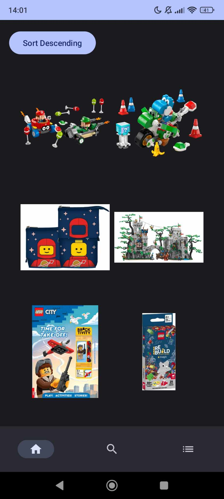
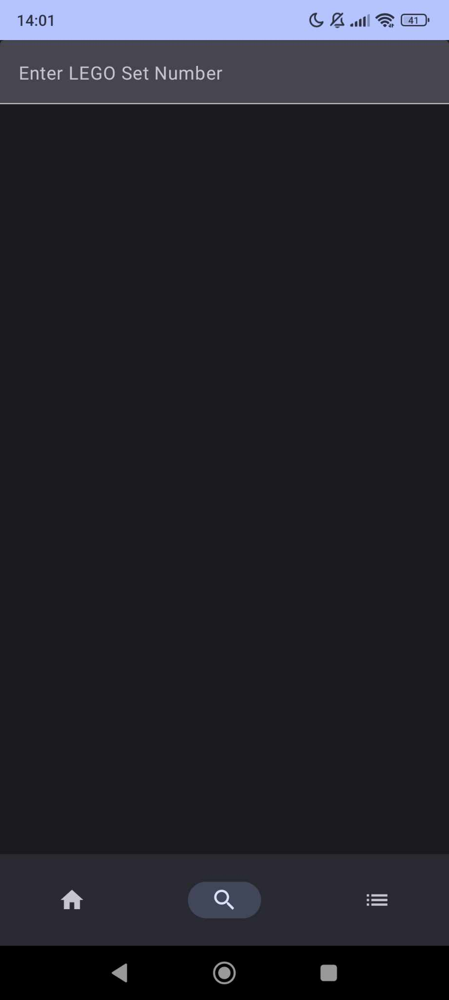
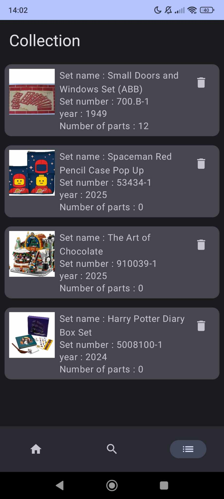
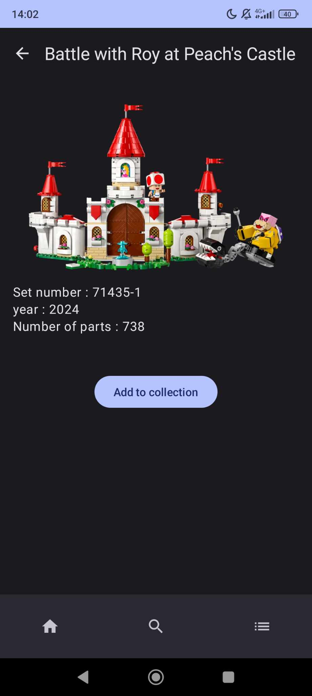

# LegoCollec

## About the Project:

As a passionate fan of LEGO, I decided to channel my love for the iconic brick brand into a project for my Mobile Development course in 2023. This project is a LEGO collection manager app, developed using Kotlin and Android Studio. The app leverages the Rebrickable API to fetch detailed LEGO set information and manage a user’s personal collection.

The goal was to create an intuitive and efficient tool to track LEGO sets, allowing users to browse, search, and manage their collections directly from their mobile devices.

## Key Features:

- Kotlin Development: I adhered to best practices in Kotlin programming, incorporating modern techniques learned during the course to ensure clean, efficient, and maintainable code.
- Rebrickable API Integration: The app connects to the Rebrickable API to fetch data on LEGO sets, such as set details, parts, and instructions.
- Local Data Storage: To store the user’s LEGO collection locally on their device, I utilized Room for reliable and efficient local database management, ensuring that the user’s data persists even without an internet connection.

## Why It’s Not Published

Despite the completion of this project, I ultimately chose not to publish the app on the Google Play Store or any other app platform. While the app is functional, I faced some limitations with the Rebrickable API, which restricted certain features and hindered the overall experience I had envisioned. These constraints, along with my personal desire to refine the app further, led me to keep it as a personal project.

## How to install

If you'd like to try the app for yourself, I installed it directly onto my device using Android Studio after configuring the necessary drivers for my smartphone. You can do the same by following these steps:

  1. Clone this repository.
  2. Connect your Android device to your computer.
  3. Ensure you have the correct device drivers installed for your phone.
  4. Run the project in Android Studio and install the APK directly onto your device.
This way, you can explore the app just as I do, without needing to go through an app store.

## Screenshots:

  
  
  
  

